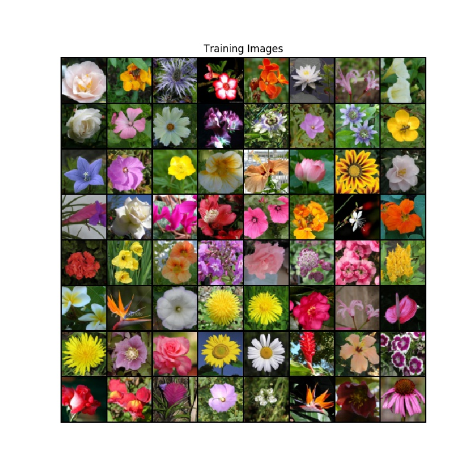
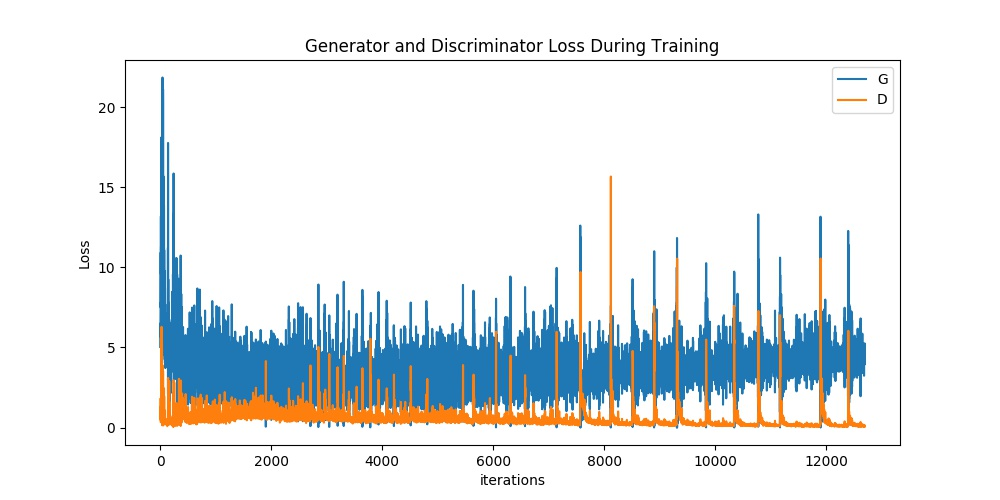

# DCGAN-Pytorch

Use dcgan to generate pictures，if you like it, please star it and the project will continue to be maintained.   

# Environments

torch==1.2.0  
torchvision==0.4.0  
numpy==1.15.1     
matplotlib==3.0.2   
ipython==7.16.1      

# Results

epoch 20:  

epoch 100:    
  

example_training_imgs:  
  

loss_curve:  

# Append

DCGAN is often used for 32 * 32 and 64 * 64 image generation. For large resolution image generation, StyleGAN、PGGAN is still needed. Of course, you can also use DCGAN to generate 128 * 128 and 512 * 512 pictures, but the quality of the generated pictures is not very good.         

# References

https://github.com/qq995431104/DCGAN-Pytorch   
https://github.com/pytorch/examples/tree/master/dcgan      
